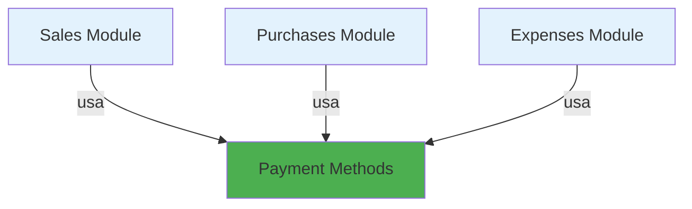

# Functional Specification: Módulo de Métodos de Pago

**Feature**: Payment Methods Module  
**Created**: February 1, 2026  
**Updated**: February 11, 2026  
**Module Type**: Independent Catalog (Sin dependencias)  
**Phase**: PHASE 1 - Specification

---

## 📋 Overview

El módulo de Métodos de Pago gestiona el catálogo de formas de pago aceptadas en transacciones comerciales (Efectivo, Tarjeta de Crédito,  Transferencia Bancaria, PSE, etc.). Es un catálogo base independiente sin dependencias de otros módulos, requerido por múltiples módulos del sistema (Sales, Purchases, Expenses) para el registro correcto de pagos y conciliación bancaria.

### Business Value
- Centraliza métodos de pago en un único catálogo reutilizable
- Facilita reportes de ventas/compras por método de pago
- Permite seguimiento de flujo de caja por forma de cobro/pago
- Simplifica conciliación bancaria al identificar origen de fondos
- Habilita configuración de comisiones por método de pago
- Reduce configuración inicial con datos precargados de Colombia

### Scope
Este módulo gestiona únicamente el catálogo de métodos de pago y sus configuraciones básicas. **No incluye** el procesamiento de pagos con pasarelas externas, la conciliación bancaria automática, ni la gestión de cuentas bancarias (esto es responsabilidad de otros módulos).

---

## 👥 User Stories

### User Story 1: Gestión de Métodos de Pago (Priority: P1)

**Como** administrador del sistema  
**Quiero** gestionar el catálogo de métodos de pago (Efectivo, Tarjeta, Transferencia, etc.)  
**Para** poder registrarlos correctamente en ventas, compras y gastos

**Why this priority?** Es fundamental para el registro correcto de transacciones comerciales y control de flujo de caja.

**Acceptance Criteria:**

1. ✅ Puedo crear métodos de pago con código único y nombre
2. ✅ Puedo listar métodos de pago activos con paginación
3. ✅ Puedo buscar métodos de pago por nombre
4. ✅ Puedo actualizar información de métodos de pago existentes
5. ✅ Puedo desactivar/activar métodos de pago (soft delete)
6. ✅ El sistema valida códigos únicos
7. ✅ El sistema previene eliminación si hay transacciones asociadas
8. ✅ Todas las operaciones quedan registradas en auditoría

**Acceptance Scenarios:**

#### Scenario 1.1: Crear método de pago Efectivo
- **Given** estoy autenticado como administrador
- **When** envío POST /api/payment-methods con:
  ```json
  {
    "code": "CASH",
    "name": "Efectivo"
  }
  ```
- **Then** recibo status 201 con el método de pago creado
- **And** el método tiene UUID asignado
- **And** se registra en AuditLog: action=PAYMENT_METHOD_CREATED

#### Scenario 1.2: Validación de código único
- **Given** existe método de pago con code "CASH"
- **When** intento crear otro método con code "CASH"
- **Then** recibo status 409 con mensaje "Payment method code already exists"

#### Scenario 1.3: Listar métodos de pago activos
- **Given** existen 10 métodos de pago, 8 activos y 2 inactivos
- **When** envío GET /api/payment-methods?enabled=true&page=0&size=20
- **Then** recibo status 200 con 8 métodos activos
- **And** metadata de paginación correcta (total, pages, current)
- **And** resultados ordenados alfabéticamente por nombre

#### Scenario 1.4: Búsqueda por nombre
- **Given** existen múltiples métodos de pago
- **When** envío GET /api/payment-methods/search?name=Tarjeta
- **Then** recibo status 200 con métodos cuyo nombre contenga "Tarjeta"
- **And** búsqueda es case-insensitive
- **And** incluye: "Tarjeta de Crédito", "Tarjeta Débito"

#### Scenario 1.5: Actualizar método de pago
- **Given** existe método "CASH" con enabled=true
- **When** envío PUT /api/payment-methods/{uuid} con datos actualizados
- **Then** recibo status 200 con el método actualizado
- **And** se registra en AuditLog: action=PAYMENT_METHOD_UPDATED

#### Scenario 1.6: Desactivar método de pago sin transacciones
- **Given** método "CHECK" activo sin transacciones asociadas
- **When** envío PATCH /api/payment-methods/{uuid}/deactivate
- **Then** recibo status 200 con enabled=false
- **And** no aparece en listados con filtro enabled=true
- **And** se registra en AuditLog: action=PAYMENT_METHOD_DEACTIVATED

#### Scenario 1.7: Validación de eliminación con transacciones
- **Given** método "CASH" tiene 1000 transacciones asociadas
- **When** intento DELETE /api/payment-methods/{uuid}
- **Then** recibo status 409 con mensaje "Cannot delete payment method with associated transactions"

#### Scenario 1.8: Obtener método de pago por UUID
- **Given** existe método con UUID "550e8400-e29b-41d4-a716-446655440000"
- **When** envío GET /api/payment-methods/550e8400-e29b-41d4-a716-446655440000
- **Then** recibo status 200 con detalles completos del método

#### Scenario 1.9: Validación de formato de código
- **Given** estoy autenticado como administrador
- **When** intento crear método con code "efectivo" (minúsculas)
- **Then** recibo status 400 con mensaje "Payment method code must contain only uppercase letters, numbers, and underscores"

#### Scenario 1.10: Activar método de pago desactivado
- **Given** método "CHECK" con enabled=false
- **When** envío PATCH /api/payment-methods/{uuid}/activate
- **Then** recibo status 200 con enabled=true
- **And** se registra en AuditLog: action=PAYMENT_METHOD_ACTIVATED

---

### User Story 2: Seed Data de Colombia (Priority: P1)

**Como** implementador del sistema  
**Quiero** que el sistema incluya datos iniciales de métodos de pago comunes en Colombia  
**Para** facilitar el despliegue y reducir configuración inicial

**Why this priority?** Reduce tiempo de configuración inicial y errores en setup.

**Acceptance Criteria:**

1. ✅ El sistema incluye migración con datos iniciales
2. ✅ Los datos iniciales son idempotentes
3. ✅ Incluye al menos 7 métodos de pago comunes en Colombia:
   - Efectivo (CASH)
   - Tarjeta de Crédito (CC)
   - Tarjeta Débito (DC)
   - Transferencia Bancaria (TRANSFER)
   - PSE - Pagos Seguros en Línea (PSE)
   - Cheque (CHECK)
   - Crédito directo (CREDIT)

**Acceptance Scenarios:**

#### Scenario 2.1: Primera instalación con seed data
- **Given** la base de datos está vacía
- **When** se ejecutan las migraciones Flyway
- **Then** la tabla payment_methods contiene 7 registros
- **And** todos están activos (enabled=true)
- **And** los códigos son únicos (CASH, CC, DC, TRANSFER, PSE, CHECK, CREDIT)

#### Scenario 2.2: Re-ejecución es idempotente
- **Given** ya existen los métodos iniciales
- **When** se re-ejecuta la migración de seed data
- **Then** no se crean registros duplicados
- **And** los existentes no se modifican

---

## 🚫 Out of Scope

Lo siguiente NO está incluido en este módulo:

1. **Procesamiento de pagos con pasarelas**: Integración con Stripe, PayU, etc. (módulo Payments)
2. **Conciliación bancaria automática**: Matching de transacciones (módulo Banking)
3. **Gestión de cuentas bancarias**: CRUD de cuentas (módulo Banking)
4. **Gestión de terminales POS**: Configuración de datáfonos (módulo POS)
5. **Gestión de comisiones reales**: Cálculo y registro de comisiones (módulo Accounting)
6. **Reportes financieros**: Reportes complejos de flujo de caja (módulo Reports)
7. **Split payments**: Pagos divididos en múltiples métodos (módulo Sales/Purchases)
8. **Tests de integración/E2E**: Fuera del scope del proyecto

---

## 📊 Business Rules

### BR-PM-001: Código Único
- Cada método de pago debe tener un código único en el sistema
- El código es case-sensitive
- Formato: Letras mayúsculas + números + guiones bajos (ej: CASH, CC_VISA, BANK_TRANSFER)
- Longitud: máximo 30 caracteres
- Patrón regex: `^[A-Z0-9_]+$`

### BR-PM-002: Soft Delete
- Los métodos de pago se desactivan (enabled=false), no se eliminan físicamente
- Un método desactivado no aparece en listados con filtro enabled=true
- Un método desactivado no puede ser usado en nuevas transacciones
- Las transacciones históricas mantienen referencia al método usado
- No se puede eliminar (ni desactivar) un método si tiene transacciones asociadas
- Se debe verificar relaciones con: Sales, Purchases, Expenses
- Se debe mostrar mensaje descriptivo indicando la restricción

### BR-PM-003: Auditoría Obligatoria
- Todas las operaciones (CREATE, UPDATE, ACTIVATE, DEACTIVATE) se registran en auditoría
- Campos obligatorios: createdBy, createdAt, updatedBy, updatedAt
- Para desactivaciones: deletedBy, deletedAt

---

## 📐 Non-Functional Requirements

### Performance
- **Tiempo de respuesta**: < 100ms para operaciones de lectura (p95)
- **Tiempo de respuesta**: < 200ms para operaciones de escritura (p95)
- **Throughput**: Mínimo 100 req/s

### Reliability
- **Disponibilidad**: 99.9% uptime
- **Tolerancia a fallos**: Retry automático en fallos transitorios

### Scalability
- Soportar hasta 100 métodos de pago activos
- Paginación obligatoria en listados

### Security
- Autenticación obligatoria para todas las operaciones
- Solo usuarios con rol ADMIN pueden crear/modificar/desactivar métodos

### Observability
- Logs estructurados de todas las operaciones
- Métricas de uso por método de pago
- Health checks para validar disponibilidad

---

## 🎯 Success Criteria

Este módulo se considera exitoso cuando:

1. ✅ Se pueden gestionar métodos de pago con CRUD completo
2. ✅ El sistema incluye 7 métodos de pago iniciales para Colombia
3. ✅ Los módulos de Sales, Purchases y Expenses pueden consultar y usar los métodos
4. ✅ Se previene la eliminación de métodos con transacciones
5. ✅ Todas las operaciones tienen auditoría completa
6. ✅ La cobertura de tests unitarios es >= 85%
7. ✅ La documentación API (OpenAPI) está completa
8. ✅ Los tiempos de respuesta cumplen SLA: < 100ms p95
9. ✅ El build Maven es exitoso sin errores ni warnings
10. ✅ Las migraciones Flyway se ejecutan correctamente

---

## 📚 References

- [Medios de pago en Colombia - Superintendencia Financiera](https://www.superfinanciera.gov.co/)
- [PSE - Pagos Seguros en Línea](https://www.pse.com.co/)
- [Reglamentación de pagos electrónicos - Banco de la República](https://www.banrep.gov.co/)
- [Scaffolding Base del Proyecto](../../scaffolding.md)
- [Technical Specification](2-technical-spec.md)

---

## 📝 Change Log

| Version | Date | Author | Changes |
|---------|------|--------|---------|
| 1.0 | 2026-02-01 | Development Team | Initial version |
| 1.1 | 2026-02-11 | GitHub Copilot | Updated to match geography module format, added more scenarios |

---

## 🔗 Related Modules

- **document-types**: Módulo similar de catálogo independiente
- **geography**: Módulo similar de catálogo independiente
- **tax-types**: Módulo relacionado para impuestos
- **units-of-measure**: Módulo relacionado para unidades

---

## 📊 Module Dependencies



**Independent Module**: Payment Methods no tiene dependencias de otros módulos.  
**Consumed by**: Sales, Purchases, Expenses (módulos futuros)
