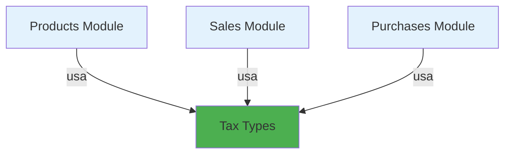

# Functional Specification: Módulo de Tipos de Impuestos

**Feature**: Tax Types Module  
**Created**: February 1, 2026  
**Updated**: February 13, 2026  
**Module Type**: Independent Catalog (Sin dependencias)  
**Phase**: PHASE 1 - Specification

---

## 📋 Overview

El módulo de Tipos de Impuestos gestiona el catálogo de tipos de impuestos aplicables en transacciones comerciales (IVA, ReteFuente, ReteIVA, ICA, etc.). Es un catálogo base independiente sin dependencias de otros módulos, requerido por múltiples módulos del sistema (Products, Sales, Purchases) para el cálculo correcto de impuestos y cumplimiento tributario.

### Business Value
- Centraliza configuración de impuestos en un único catálogo reutilizable
- Garantiza cálculo consistente de impuestos en todo el sistema
- Facilita cumplimiento de normativa tributaria colombiana
- Permite generación automática de reportes fiscales
- Simplifica adaptación a cambios en tasas impositivas
- Reduce configuración inicial con datos precargados de Colombia

### Scope
Este módulo gestiona únicamente el catálogo de tipos de impuestos y sus configuraciones básicas. **No incluye** el cálculo de impuestos en transacciones (responsabilidad de módulos Sales/Purchases), ni la generación de reportes tributarios complejos, ni la integración con la DIAN.

---

## 👥 User Stories

### User Story 1: Gestión de Tipos de Impuestos (Priority: P1)

**Como** administrador del sistema  
**Quiero** gestionar el catálogo de tipos de impuestos (IVA, ReteFuente, etc.)  
**Para** poder aplicarlos correctamente en productos, ventas y compras

**Why this priority?** Es fundamental para el cumplimiento tributario y el cálculo correcto de impuestos en todas las transacciones comerciales.

**Acceptance Criteria:**

1. ✅ Puedo crear tipos de impuestos con código único, nombre y porcentaje
2. ✅ Puedo configurar si el impuesto es incluido o adicional al precio
3. ✅ Puedo especificar el tipo de aplicación (ventas, compras o ambos)
4. ✅ Puedo listar tipos de impuestos activos con paginación
5. ✅ Puedo buscar tipos de impuestos por nombre o código
6. ✅ Puedo actualizar información de tipos de impuestos existentes
7. ✅ Puedo desactivar/activar tipos de impuestos (soft delete)
8. ✅ El sistema valida códigos únicos
9. ✅ El sistema previene eliminación si hay productos/transacciones asociadas
10. ✅ Todas las operaciones quedan registradas en auditoría

**Acceptance Scenarios:**

#### Scenario 1.1: Crear tipo de impuesto IVA 19%
- **Given** estoy autenticado como administrador
- **When** envío POST /api/v1/tax-types con:
  ```json
  {
    "code": "IVA19",
    "name": "IVA 19%",
    "percentage": 19.0,
    "isIncluded": false,
    "applicationType": "BOTH"
  }
  ```
- **Then** recibo status 201 con el tipo de impuesto creado
- **And** el tipo de impuesto tiene UUID asignado
- **And** se registra en AuditLog: action=TAX_TYPE_CREATED

#### Scenario 1.2: Validación de código único
- **Given** existe tipo de impuesto con code "IVA19"
- **When** intento crear otro tipo de impuesto con code "IVA19"
- **Then** recibo status 409 con mensaje "Tax type code already exists"

#### Scenario 1.3: Crear ReteFuente con porcentaje decimal
- **Given** estoy autenticado como administrador
- **When** envío POST /api/v1/tax-types con:
  ```json
  {
    "code": "RETE_2.5",
    "name": "ReteFuente 2.5%",
    "percentage": 2.5,
    "isIncluded": false,
    "applicationType": "PURCHASE"
  }
  ```
- **Then** recibo status 201 con el tipo de impuesto creado
- **And** percentage se almacena con precisión decimal (2.5000)

#### Scenario 1.4: Listar tipos de impuestos activos
- **Given** existen 15 tipos de impuestos, 12 activos y 3 inactivos
- **When** envío GET /api/v1/tax-types?enabled=true&page=0&size=20
- **Then** recibo status 200 con 12 tipos de impuestos activos
- **And** metadata de paginación correcta (total, pages, current)
- **And** resultados ordenados alfabéticamente por código

#### Scenario 1.5: Búsqueda por nombre
- **Given** existen múltiples tipos de impuestos
- **When** envío GET /api/v1/tax-types?name=IVA
- **Then** recibo status 200 con tipos cuyo nombre contenga "IVA"
- **And** búsqueda es case-insensitive
- **And** incluye: "IVA 19%", "IVA 5%", "IVA 0%"

#### Scenario 1.6: Actualizar porcentaje de tipo de impuesto
- **Given** existe tipo de impuesto IVA con percentage=19.0
- **When** envío PUT /api/v1/tax-types/{uuid} con percentage=21.0
- **Then** recibo status 200 con el tipo actualizado
- **And** se registra en AuditLog: action=TAX_TYPE_UPDATED

#### Scenario 1.7: Desactivar tipo de impuesto sin uso
- **Given** tipo de impuesto "IVA5" activo sin productos asociados
- **When** envío PATCH /api/v1/tax-types/{uuid}/deactivate
- **Then** recibo status 200 con enabled=false
- **And** el tipo de impuesto no aparece en listados con filtro enabled=true
- **And** se registra en AuditLog: action=TAX_TYPE_DEACTIVATED

#### Scenario 1.8: Validación de eliminación con productos asociados
- **Given** tipo de impuesto "IVA19" tiene 500 productos asociados
- **When** intento DELETE /api/v1/tax-types/{uuid}
- **Then** recibo status 409 con mensaje "Cannot delete tax type with associated products"

#### Scenario 1.9: Obtener tipo de impuesto por UUID
- **Given** existe tipo de impuesto con UUID "550e8400-e29b-41d4-a716-446655440000"
- **When** envío GET /api/v1/tax-types/550e8400-e29b-41d4-a716-446655440000
- **Then** recibo status 200 con detalles completos del tipo de impuesto

#### Scenario 1.10: Validación de porcentaje válido
- **Given** estoy autenticado como administrador
- **When** intento crear tipo de impuesto con percentage=-5.0
- **Then** recibo status 400 con mensaje "Percentage must be between 0 and 100"

#### Scenario 1.11: Validación de formato de código
- **Given** estoy autenticado como administrador
- **When** intento crear tipo de impuesto con code "iva-19" (minúsculas)
- **Then** recibo status 400 con mensaje "Tax type code must contain only uppercase letters, numbers, dots, and hyphens"

#### Scenario 1.12: Activar tipo de impuesto desactivado
- **Given** tipo de impuesto "IVA5" con enabled=false
- **When** envío PATCH /api/v1/tax-types/{uuid}/activate
- **Then** recibo status 200 con enabled=true
- **And** se registra en AuditLog: action=TAX_TYPE_ACTIVATED

#### Scenario 1.13: Validación de porcentaje máximo
- **Given** estoy autenticado como administrador
- **When** intento crear tipo de impuesto con percentage=150.0
- **Then** recibo status 400 con mensaje "Percentage must be between 0 and 100"

#### Scenario 1.14: Validación de precisión decimal
- **Given** estoy autenticado como administrador
- **When** intento crear tipo de impuesto con percentage=19.123456 (6 decimales)
- **Then** recibo status 400 con mensaje "Percentage cannot have more than 4 decimal places"

---

### User Story 2: Consulta de Tipos de Impuestos por Aplicación (Priority: P2)

**Como** desarrollador del módulo de productos  
**Quiero** consultar tipos de impuestos filtrados por aplicación (ventas, compras)  
**Para** mostrar solo los impuestos relevantes en cada contexto

**Why this priority?** Mejora la experiencia de usuario al configurar productos, mostrando solo impuestos aplicables.

**Acceptance Criteria:**

1. ✅ Puedo filtrar tipos de impuestos por applicationType
2. ✅ El filtro acepta valores: SALE, PURCHASE, BOTH
3. ✅ Los tipos con applicationType=BOTH aparecen en ambos filtros
4. ✅ Los resultados están ordenados alfabéticamente

**Acceptance Scenarios:**

#### Scenario 2.1: Filtrar impuestos para ventas
- **Given** existen los siguientes tipos de impuestos:
  - IVA19 (applicationType=BOTH)
  - IVA5 (applicationType=BOTH)
  - ReteFuente2.5 (applicationType=PURCHASE)
  - ICA (applicationType=SALE)
- **When** envío GET /api/v1/tax-types?applicationType=SALE&enabled=true
- **Then** recibo status 200 con 3 tipos de impuestos: IVA19, IVA5, ICA
- **And** NO incluye ReteFuente2.5

#### Scenario 2.2: Filtrar impuestos para compras
- **Given** mismos tipos de impuestos del scenario anterior
- **When** envío GET /api/v1/tax-types?applicationType=PURCHASE&enabled=true
- **Then** recibo status 200 con 3 tipos de impuestos: IVA19, IVA5, ReteFuente2.5
- **And** NO incluye ICA

---

### User Story 3: Seed Data de Colombia (Priority: P1)

**Como** implementador del sistema  
**Quiero** que el sistema incluya datos iniciales de impuestos comunes en Colombia  
**Para** facilitar el despliegue y reducir configuración inicial

**Why this priority?** Reduce tiempo de configuración inicial y errores en setup.

**Acceptance Criteria:**

1. ✅ El sistema incluye migración con datos iniciales
2. ✅ Los datos iniciales son idempotentes
3. ✅ Incluye exactamente 10 tipos de impuestos comunes en Colombia según la siguiente tabla:

| Código | Nombre | Percentage | isIncluded | applicationType | Descripción |
|--------|--------|------------|------------|-----------------|-------------|
| IVA19 | IVA 19% | 19.0000 | false | BOTH | Impuesto al Valor Agregado - Tarifa general |
| IVA5 | IVA 5% | 5.0000 | false | BOTH | Impuesto al Valor Agregado - Tarifa reducida |
| IVA0 | IVA 0% | 0.0000 | false | BOTH | Bienes y servicios exentos de IVA |
| RETE_SERV_2.5 | ReteFuente Servicios 2.5% | 2.5000 | false | PURCHASE | Retención en la fuente por servicios |
| RETE_SERV_4.0 | ReteFuente Servicios 4% | 4.0000 | false | PURCHASE | Retención en la fuente por servicios profesionales |
| RETE_HON_10.0 | ReteFuente Honorarios 10% | 10.0000 | false | PURCHASE | Retención en la fuente por honorarios |
| RETE_COMP_2.5 | ReteFuente Compras 2.5% | 2.5000 | false | PURCHASE | Retención en la fuente por compras |
| RETEIVA_15 | ReteIVA 15% | 15.0000 | false | PURCHASE | Retención de IVA |
| ICA_BOG_SERV | ICA Bogotá Servicios 0.414% | 0.4140 | false | BOTH | Impuesto de Industria y Comercio - Servicios |
| ICA_BOG_IND | ICA Bogotá Industrial 0.966% | 0.9660 | false | BOTH | Impuesto de Industria y Comercio - Industrial |

**Acceptance Scenarios:**

#### Scenario 3.1: Primera instalación con seed data
- **Given** la base de datos está vacía
- **When** se ejecutan las migraciones Flyway
- **Then** la tabla tax_types contiene exactamente 10 registros
- **And** todos están activos (enabled=true)
- **And** los códigos son únicos: IVA19, IVA5, IVA0, RETE_SERV_2.5, RETE_SERV_4.0, RETE_HON_10.0, RETE_COMP_2.5, RETEIVA_15, ICA_BOG_SERV, ICA_BOG_IND
- **And** todos los porcentajes tienen precisión de 4 decimales
- **And** las ReteFuente tienen applicationType=PURCHASE
- **And** los IVA tienen applicationType=BOTH

#### Scenario 3.2: Re-ejecución es idempotente
- **Given** ya existen los tipos de impuestos iniciales
- **When** se re-ejecuta la migración de seed data
- **Then** no se crean registros duplicados
- **And** los existentes no se modifican

---

## 🚫 Out of Scope

Lo siguiente NO está incluido en este módulo:

1. **Cálculo de impuestos en transacciones**: Responsabilidad de módulos Sales/Purchases
2. **Reportes tributarios complejos**: Reportes DIAN, certificados (módulo Reports)
3. **Impuestos compuestos**: Combinación de múltiples impuestos en uno solo
4. **Configuración por región**: Impuestos específicos por departamento/ciudad (todos son nacionales)
5. **Gestión de periodos fiscales**: Declaraciones mensuales/bimestrales
6. **Declaraciones tributarias**: Generación automática de declaraciones DIAN
7. **Integración con DIAN**: Envío electrónico de información (módulo futuro)
8. **Retenciones en la fuente automáticas**: Cálculo según rangos UVT (módulo Accounting)
9. **Tests de integración/E2E**: Fuera del scope del proyecto

---

## 📊 Business Rules

### BR-TT-001: Código Único
- Cada tipo de impuesto debe tener un código único en el sistema
- El código es case-sensitive
- Formato: Letras mayúsculas + números + puntos + guiones + underscores (ej: IVA19, RETE_2.5, ICA-BOG)
- Longitud: máximo 20 caracteres
- Patrón regex: `^[A-Z0-9._-]+$`

### BR-TT-002: Porcentaje Válido
- El porcentaje debe estar entre 0.0000 y 100.0000
- Precisión máxima: 4 decimales
- Porcentaje 0 es válido (bienes exentos de IVA)
- El porcentaje es obligatorio (no puede ser NULL)

### BR-TT-003: Tipo de Aplicación
- Valores permitidos: SALE, PURCHASE, BOTH
- Un tipo de impuesto con BOTH aparece en contextos de ventas Y compras
- El tipo de aplicación es obligatorio (no puede ser NULL)
- Default recomendado: BOTH (para simplificar configuración)

### BR-TT-004: Soft Delete
- Los tipos de impuestos se desactivan (enabled=false), no se eliminan físicamente
- Un tipo desactivado no aparece en listados con filtro enabled=true
- Un tipo desactivado no puede ser asignado a nuevos productos
- Los productos existentes mantienen referencia al tipo de impuesto usado
- Las transacciones históricas mantienen referencia al tipo de impuesto usado

### BR-TT-005: Validación de Eliminación
- No se puede eliminar (ni desactivar) un tipo de impuesto si tiene productos asociados
- No se puede eliminar (ni desactivar) un tipo de impuesto si tiene transacciones asociadas
- Se debe verificar relaciones con: Products, Sales, Purchases
- Se debe mostrar mensaje descriptivo indicando la restricción

### BR-TT-006: Impuesto Incluido vs Adicional
- `isIncluded=true`: El impuesto está incluido en el precio mostrado (ej: IVA en precio retail)
- `isIncluded=false`: El impuesto se calcula sobre el precio base (ej: IVA en facturación B2B)
- Para ReteFuente: siempre isIncluded=false (se resta del total)
- Esta configuración afecta el cálculo de subtotal en transacciones

### BR-TT-007: Auditoría Obligatoria
- Todas las operaciones (CREATE, UPDATE, ACTIVATE, DEACTIVATE) se registran en auditoría
- Campos obligatorios: createdBy, createdAt, updatedBy, updatedAt
- Para desactivaciones: deletedBy, deletedAt

---

## 📐 Non-Functional Requirements

### Performance
- **Tiempo de respuesta**: < 100ms para operaciones de lectura (p95)
- **Tiempo de respuesta**: < 200ms para operaciones de escritura (p95)
- **Throughput**: Mínimo 100 req/s

### Reliability
- **Disponibilidad**: 99.9% uptime
- **Tolerancia a fallos**: Retry automático en fallos transitorios

### Scalability
- Soportar hasta 50 tipos de impuestos activos
- Paginación obligatoria en listados

### Security
- Autenticación obligatoria para todas las operaciones
- Solo usuarios con rol ADMIN pueden crear/modificar/desactivar tipos de impuestos

### Observability
- Logs estructurados de todas las operaciones
- Métricas de uso por tipo de impuesto
- Health checks para validar disponibilidad

---

## 🎯 Success Criteria

Este módulo se considera exitoso cuando:

1. ✅ Se pueden gestionar tipos de impuestos con CRUD completo
2. ✅ El sistema incluye 10 tipos de impuestos iniciales para Colombia
3. ✅ Los módulos de Products, Sales y Purchases pueden consultar y usar los tipos de impuestos
4. ✅ Se previene la eliminación de tipos con productos/transacciones asociadas
5. ✅ Todas las operaciones tienen auditoría completa
6. ✅ La cobertura de tests unitarios es >= 85%
7. ✅ La documentación API (OpenAPI) está completa
8. ✅ Los tiempos de respuesta cumplen SLA: < 100ms p95
9. ✅ El build Maven es exitoso sin errores ni warnings
10. ✅ Las migraciones Flyway se ejecutan correctamente

---

## 📚 References

- [Estatuto Tributario Nacional - Colombia](https://www.dian.gov.co/)
- [DIAN - Dirección de Impuestos y Aduanas Nacionales](https://www.dian.gov.co/)
- [Retención en la Fuente - Decreto 1625/2016](https://www.funcionpublica.gov.co/)
- [ICA - Impuesto de Industria y Comercio](https://www.ccb.org.co/)
- [Scaffolding Base del Proyecto](../../scaffolding.md)
- [Technical Specification](2-technical-spec.md)

---

## 📝 Change Log

| Version | Date | Author | Changes |
|---------|------|--------|---------|
| 1.0 | 2026-02-01 | Development Team | Initial version |
| 1.1 | 2026-02-13 | GitHub Copilot | Updated to match payment-methods format, added more scenarios |

---

## 🔗 Related Modules

- **document-types**: Módulo similar de catálogo independiente
- **payment-methods**: Módulo similar de catálogo independiente
- **units-of-measure**: Módulo relacionado para unidades
- **products**: Consumidor principal de este módulo

---

## 📊 Module Dependencies



**Independent Module**: Tax Types no tiene dependencias de otros módulos.  
**Consumed by**: Products, Sales, Purchases (módulos futuros)
